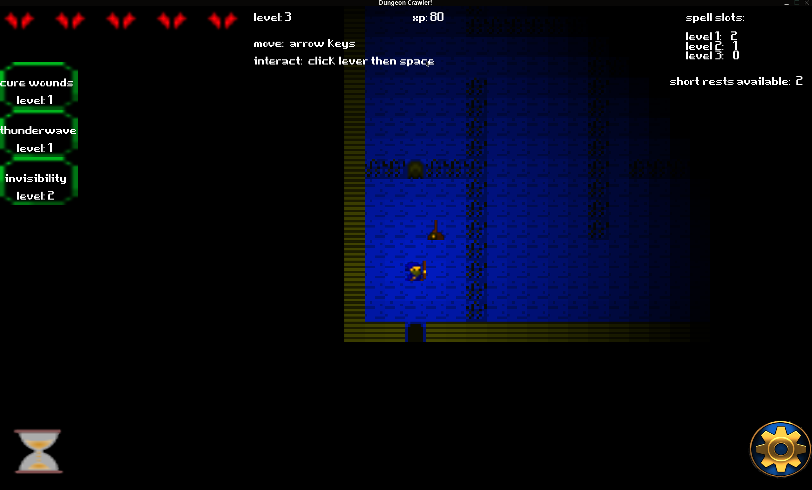

# *Dungeon Crawler* ~ *by Elliot*

Demo du jeu :

## À propos de ce jeu

Développer ce petit jeu m'a permis de progresser en Lua et en Löve2D, dans le cadre des ateliers de programmation que [Lilian Besson](https://GitHub.com/Naereen) et [Régis](https://github.com/regisb) et [Jean](https://github.com/Jehadel) anime au printemps 2023 à la Ludothèque et au Fablab de Briançon (voir [cette page](https://github.com/aucoindujeu/codeclub)).

==> Jouez ici : <https://Elliott005.github.io/Dungeon-Crawler/www/>

----

## Avancement du mini projet

- [x] Ceci est déjà fait

## Objectifs bonus ?

### Idées supplémentaires ?

- [ ] TODO:

## License ?

[MIT Licensed](LICENSE)
© [Elliot](https://github.com/Elliott005), 2023
